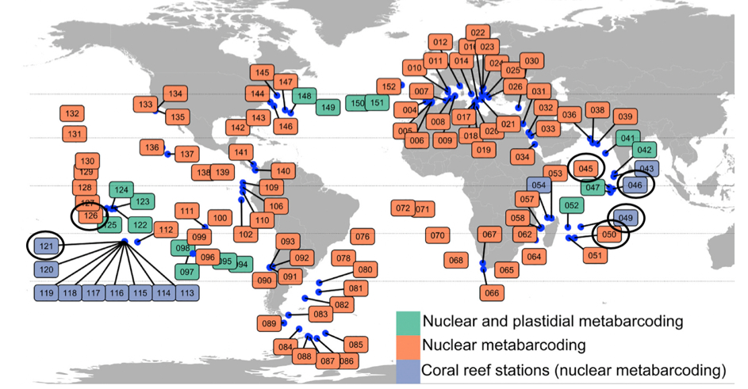
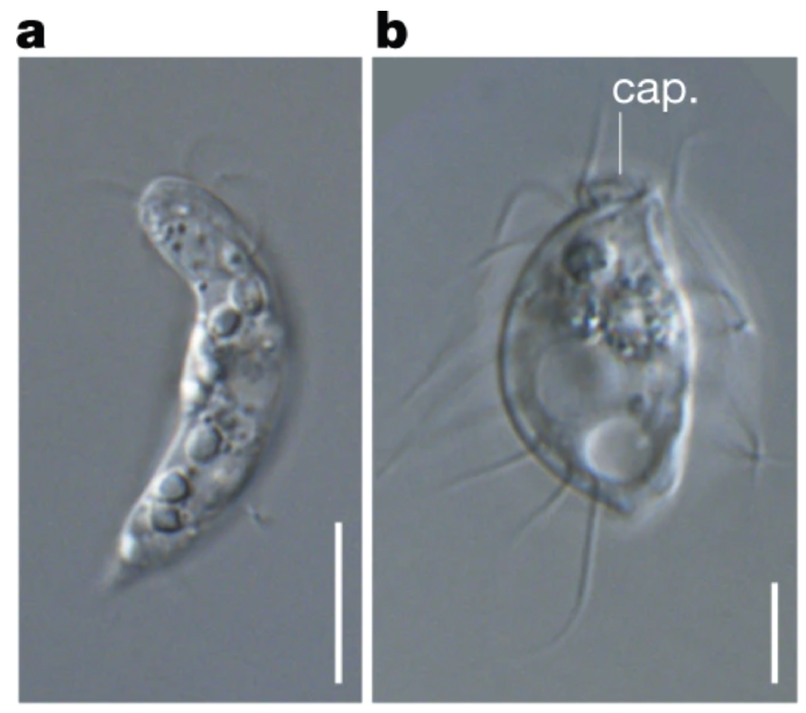
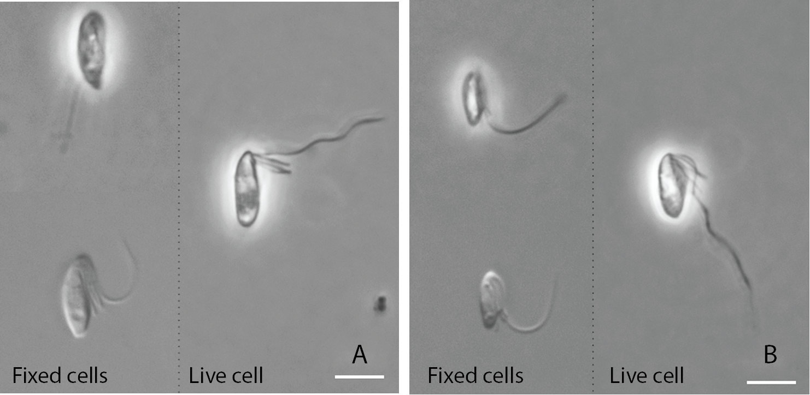
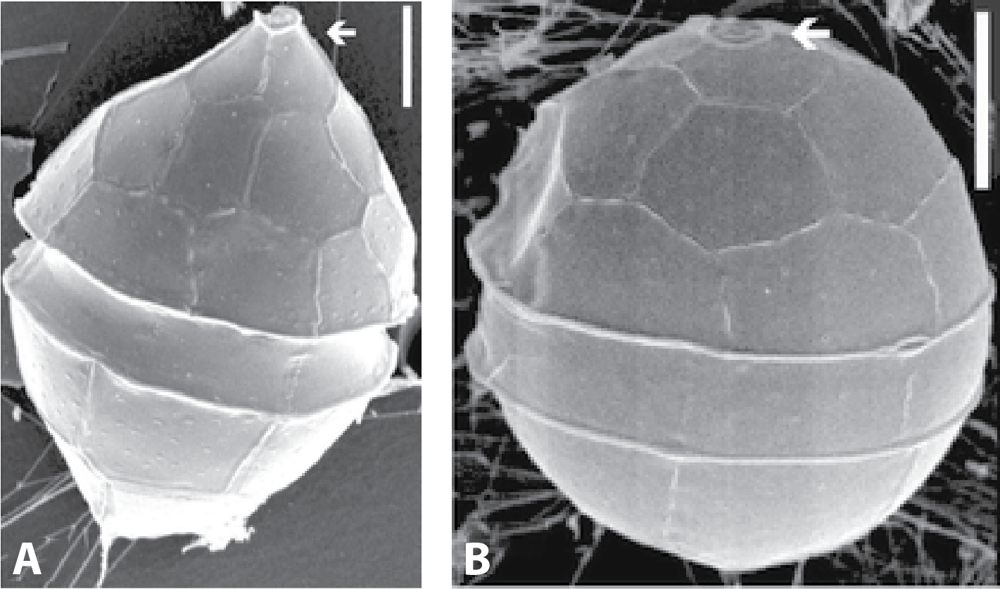

# The data
***

In this section, you will work with a subset of data from the Tara Oceans Expedition (de Vargas et al. 2015, _Science_). For this lab, we have gathered sequences from two marine environments: Coral Reefs, and Open Ocean. Each environment is represented by three stations each, meaning that you will be working with data from 6 stations in total. The location of these stations is shown in the map in Figure 2.



<br>

The Tara Oceans project used a region (V9) of the 18S gene (the Small Ribosomal Subunit gene in eukaryotes, see Figure 3 below) as a metabarcode. 


<br>

These sequences were correspond to organisms living in surface water (~ 7 m depth) collected from the six stations. The water was size fractionated to recover biodiversity from major organismal size fractions: pico-nanoplankton (0.8 to 5 microns), nanoplankton (5 to 20 microns), microplankton (20 to 180 microns) and mesoplankton (180 to 2000 microns). _However, in this lab we have merged all the size fractions for simplicity._


## Getting a feel for your data
Normally, we start our data analysis with a LOT of reads or metabarcodes. The first step is to filter these reads based on quality and then cluster them into biologically meaningful Operational Taxonomic Units (OTUs). Here, in the interest of time, we have already cleaned the reads and clustered them into OTUs.


```{r, eval=TRUE}
# read table containing metadata about stations
otus <- read.csv("data/metadata.txt", header=T, sep = "\t")
otus

```


<br>

**Questions:**  
**1.  The Tara Oceans Project found ~110,000 OTUs in total from surface waters of tropical and temperate oceans. Pick any *one* of the six stations. What proportion of total species diversity is present at that station?**


## What do these OTUs represent anyway?

OTUs are often defined using sequence similarity thresholds (traditionally sequences more than 97% dissimilar are treated as belonging to different species, though other criteria are also frequently used). But what do these OTUs actually represent? Does OTU = species? Here we will evaluate what OTUs represent using several different examples of described species. 


### Scenario 1

You isolate two cells from soil samples in Nova Scotia, Canada and photograph them using contrast light microscopy (Figure 4).



<br>

**Questions:**   
**2. Based on morphology, do you think A and B are different species?**  

You then generate 18S sequences (provided below) for both cells to confirm their identity. You align them together to find how similar they are to each other. To do so, use the [blast2seq website](https://blast.ncbi.nlm.nih.gov/Blast.cgi?BLAST_SPEC=blast2seq&LINK_LOC=align2seq&PAGE_TYPE=BlastSearch), and copy paste the sequences, one in each box. (NB: the following DNA sequences are in fasta format, a commonly used format for representing nucleotide and amino-acid sequences).

<details>
<summary>Click to read more about the fasta format</summary>
<br>
There are two types of lines in a fasta file. The fasta header line starts with “>” and contains a description of the sequence (here for example, the fasta headers are “>seq_A” and “>seq_B”). Subsequent lines (not starting with “>”) contain the sequence information.
</details>

<br>

>\>seq_A
GGTTCGATTCCGGAGAGGGAGCCTGAGAAATGGCTACCACATCTAAGGATGGCAGCAGGCGCGCAAATTACCCAATCCTGACACAGGGAGGTAGTGACAATAAATATCGATAGTCGCCTTTTTACAGGAGACTAATTGAAATGAGAACAATTTAAACCCCTTAACGAGGATCCATTGGAGGGCAAGTCTGGTGCCAGCAGCCGCGGTAATTCCAGCTCCAATAGCGTATATTAAAGTTGTTGCAGTTAAAAAGCTCGTAGTTGGATTTCAGAATCGTGCGTGGCCTGTAACAGGGTCATTCAAAGATTCGGAGCTTGATTCGAATGAGTTGAGCTTTGGGTCACGATTCTTACCTATTATTCACGGCGGGGCAACTCACCGAGGATAATTCGTTTACTGTGAAAAAATTAGAGTGTTCAAAGCAGGCGTTCGCCATTCATTATGAATACATTAGCATGGAATAATAAAATAGGACTTTAGTTTTATTTTATTGGATCCTAGGACTAAAGTAATGATTAATAGGGACAGTTGGGGGTATTCGTATTCTTGAGTCAGAGGTGAAATTCTTAGATTTCAGGAAGACGAACTTCTGCGAAAGCATTTACCAAGGATGTTTTCATTAATCAAGAACGAAAGTTGGGGGATCGAAGACGATCAGATACCGTCGTAGTCTCAACCATAAACGATGCCGACTAGGGATCAGTGAATGTTTTATATTTGACTTCATTGGCACCTCCAGAGAAATCGCAAGTTTTTGGGTTCTGGGGGGAGTATGGTCGCAAGGCTGAAACTTAAAGGAATTGACGGAAGGGCACCACCAGGAGTGGAGCCTGCGGCTTAATTTGACTCAACACGGGAAAACTTACCAGGTCCAGACATAGCAAGGATTGACAGATTGAAAGACCTTTCTTGATTCTATGGGTGGTGGTGCATGGCCGTTCTTAGTTGGTGGAGTGATTTGTCTGCTTAATTGCGATAACGAACGAGACCTTAACCTACTAACTAGTCACACTAACCTTCCGAAATGGTGTTGGTGGCGGACTTCTTAGAGGGACAACGTGTGCTGAGCACGAGGAAGTTTGAGGCAATAACAGGTCTGTGATGCCCTTAGATGTTCTGGGCCGCACGCGCGCTACACTGATACAATCAATGAGTTTCTACAAGACCTTAACTGATAAGTTTGGGTAATCTTTTGAAATTGTATCGTGATGGGGATAGATCATTGCAACTATTGATCTTCAACGAGGAATTCCTAGTAAGCGTAAGTCATCAGCTTACGTTGATTACGTCCCTGCCCTTTGTACACACCGCCCGTCGCTCCTACCGATTGGATGATTCGGTGAACTTTTCGGACCGTGATCTATTGTTGGGAAACCAGCGTGGATCG

>\>seq_B
GAATCAGGGTTCGATTCCGGAGAGGGAGCCTGAAGCTGTGAAACAACGGGCTTGATAGTGGCCTGGCAACAGGACGCTAGTTACGCTCTGACCGTAGCGACACCTTCAAATTGCTGGAAGTCCCTAAAGCTCTTAGTACCGCGGCGCCTGGCAACAGAGCGTGCAGCAGGTGGTGTAGTGGCCACTGGGTGGTAACAATCTAAGAGATGACACAATGGGTAACCAGCAGCCAAGTGGCCTCTGGCCATGCAGTTCACAGACTAAATGTTGGTGGGCGACCTCTGGGTTGCTTAAGATATAGTCGGCCGGCCGCAGAAATGCGGTTCTCTAAGAGGAATCTTCACTGCGAGTCAGAGAGCACGCAGCAGTGGAGAGGAGAGCTTAGAGACAGCCAGCACTGGACCAGTGCCTCGGCTGCGATCAGCGGAGAAATGGCTACCACATCCAAGGATGGCAGCAGGCGCGCAAATTACCCAATCCTGACACAGGGAGGTAGTGACAATAAATATCAATAGTGGACTTTTTACAGTACACTAATTGAAATGAGAACAATTTAAATCCCTTATCGAGGAACAATTGGAGGGCAAGTCTGGTGCCAGCAGCCGCGGTAATTCCAGCTCCAATAGCGTATATTAAAGTTGTTGCAGTTAAAAAGCTCGTAGTTGGATTTCGGGGAGGTCAGGCGTCGTAGGGCAATAGTTCTGCGGTTGTCGGCTTCTCTTACCTGTCTGGCATTGCCCTCGTTGGTGGTGCTAGGCTCGTTTACTGTGAAAAAATTAGAGTGTTCAAAGCAGGCTTACGCTGTGAATACATTAGCATGGAATAATAGAATAGGACTTTGGCCCTATTTTGTTGGTTTCTAGGACCGAAGTAATGATTAATAGGGACAGTTGGGGGCATTCGTATTTTACAGTCAGAGGTGAAATTCTTAGATTTGTGAAAGACGAACTACTGCGAAAGCATTTGCCAAGGATGTTTTCATTAATCAAGAACGAAAGTTAGGGGATCGAAGACGATCAGATACCGTCGTAGTCTTAACCATAAACGATGCCAACTAGGGATGGGCAGATGTTAACTTTATGACTCTGTCCGCACCTCCAGAGAAATCGCAAGTTTT

<br>

**Questions:**  
**3. What is the percentage identity between the two sequences? Does this information change your answer to question 2? Why or why not?**


### Scenario 2

Imagine that you collected several marine samples from different areas. You observe samples A and B under the microscope and take the following images (Figure 5).



<br>

**Questions:**  
**4. Would you describe as the same species or different species based on the information you have?**  
**5. Using the blast2seq server, what is the percentage identity between the two sequences (provided below)? Does it change your answer to the previous question?**  

>\>seq_A
GGCTCCATATACTAGTGAGAACCTACCTACTCAGTCAACTACAAGGCTAACCTTGCCAACAGCAAGGCTAATACTTGACTAACCAGCTACCTTAGGGTAGCAGCGTAAGGTCTAGCTTGACAGCTACCTTACATAGTAAGCTACTAGCTTACTGGTTGACCTGTAAGGGCTAAGGGCTGCTACTAGTAGTAGCTCGACCTAAGGCTGAGTAGAGTGCTCTCTAAGCCATTAGCTGGTAGTAAGGGTAGCGTCCTTACTAGGCGACCATGGCTACGGGGAATCAGCGTTCGATTCCGGAGAGAAAGCCTGAGACACGGCTATCACATCTAAGGAAGGCAGCAGGCGCGCAAATTGCCCAATGCAGACTCTGCGAGGCAGTGAACAGCTATACTAGCCTACATACCTAGTATGTAGGGAGGCTAATGCCTTAGAATGAATGCTGCTTAGTAAACAGCATGATAAGCTAGTAGAGGATCAGTCTGGTGCCAGCACCCGCGGTAACTCCAGCTCTGCAAGCCTATGATAATACTGTTGTCTTTAAAACGTCCGTAGCTAGCTTAAGCTAGTTGACTGCTAGTCTGTAGTATAGGCTAGCTAGTATTGCCTTTAGCTAGGTAGTGCTAGCTAGACTAACTACCTAGGTGGCTAGCTATAGCTAAGGCTGTAGCTAGCTGTAGGCTAGTAGTCTACTAGTGTAGCGACATCGCTAGTAAACAGGCATGCTCAAGGTTAGCTAAAGGGGTTTCCCTATAGCTAGAACTACATAGAGCGACACGTCAATATAGCTGGCTACTAGCTTGTCTAGTAGCCGGCGTGTACAATGAAGGGGTCTCAGGCTAGGAGTATTAGTAGGCTAGGGGTGAAATCCAGTGACCCTACTAAGACTACATGAGGCGAAAGCGCCTAGCTAGAGCCTACTTGTCGGCGATGGACGAGAGTGAAGGGCGCGAAGATGATTAGATACCGTTGTAGTCTTCACTGTAAACTATGCCAGCTTGGCTAGGTAGCTTCACCTAGTTGAAGGCTACCTAGCCATAGGGAAACTAGTAAGCTCTTCGGCTAGAGGGGTAGTACTGTCGCAAGGCAGAAACTTAAAGGAATTGACGGAAAAGCACCACCAGGCGTGGAGTCTGCGGCTTAATTCGACTCAACACGGGGAACCTTACCAGGGCAGGACACTAAGTGGATTGTCAGCCTACAGGGCTTACATGATATTGTGGAAAGTGGTGCATGGCCATTCTTAGTTCGTGAGGCGACTTGTCTCCTTAATTGAGGTAACGAGCGAGACCCTGAAGGCTAGTTGAGCCTAGCTAGCTAGTCTAGCTAGTGTGCTACCTAGTAGCCGCTCCTAGCCTGATTACTAGCGCCTAGCTAGTCGAGACAGGACAATAATAGGTCTGTTATGCCCTTAGATGGCCTGGGACGCACGCGTACTACACTGACACTCGCAGCCAGTATAGTAGCTACTAGCTATCTAGCTAGTAGCTAAGCTATGCCGTAAGGCATTGCGAAGCTGCAAAGGGTGTCTAGGTAAGGATTGCTGCCTGCAAGGGCAGCATCAATGAGGAATGCCTTGTAAGTGCCTTTCAGCATAAGGCTCTGAATACGTCCCTGCTTTTTGTACACACCGCCCGTCGCATCAAGGAACTCAACTAGGCCAATGAGCCTGCTGGACGCAAGGAAAGCAGGCAAA

>\>seq_B
AACCTGGTTGATCCTGCCAGTACCATAGGCTAGTCTTGAAGACTAAGCCATGCATGTGTCAGTGCACAGCCTAGTTTACTAGGCATTCGGAAACTGCGGATGGCTCCATATACTAGTGAGAACCTGCCTGCCCAGTCAACTACAAGGATAACCTTGCCAACAGCAAGGCTAATACTTGATAAACAGCTAGCTTCGGCTAGTAGCGCAAGGCTAAGCTTGACGGCTACCTTGCATAGTAGGCTTCGGCTTACTGGTTGACCTGAAAGGATTAAGAGCTGCTACTAGTAGTAGCTCGACCTAAGGCTGAGCAGAGAGCTCTCTAAGCCATTAGCTGGTTGTGGGGGTAGCGGCTTCACAAGGCGACTATGGCTACGGGGAATCAGCGTTCGATTCCGGAGAGAAAGCCTGAGACACGGCTATCACATCTAAGGAAGGCAGCAGGCGCGCAAATTGCCCAATGCAGATTCTGCGAGGCAGTGAACAGCCATACCGGCCTGCGCACCTAGTGCGCAGGGAGGCTTTAAGCCTTAGAATGAATGCTGCTTAACAAACAGCATGATAAGCTAGTAGAGGATCAGTCTGGTGTTGTCTTTAAACGTCCGTAGCCAGCTAAAGCTGCTAAGCTACTAGTCTGCAGCACAGGCTAGCTTCAACTACCTTTCGCTAGGTAGTAGTTGCTAGACTGGCTGCCTTGGCGGAAGCCTTTAGCATAAGCTGAAGGCTACTGTAGGCTGGTAGTTTAGTAGCGTAGCGACATCGCTAGTAAACAGGCATGCTCAAGGTAAGCTAAAGGGTTTTCCCTATGGCTTGAACTATATAGAGCGACACGTCAGTCAAGCAGGCTACTTCGGTAGCCGGCGTGAACAATGAGGGGGACTCAGGCCAGGAGTATTGGCAGGCTAGGGGTGAAATCCAGTGACCCTGCCAAGACTGCATGAGGCGAAAGCGCCTGGCTAGAGCCTACTTGTCGGCGATGGACGAGAGTGAAGGGCGCGAAGATGATTAGATACCGTTGTAGTCTTCACTGTAAACTATGCCAGCTTGGCTGGGCAGCTTCACCTAGTTGAAGGCTGCCTGGCCAAAGGGAAACTAGTAAGCTCTTCGGCTAGAGGGGTAGTACTGTCGCAAGGCAGAAACTTAAAGGAATTGACGGAAAAGCACCACCAGGCGTGGAGTCTGCGGCTTAATTCGACTCAACACGGGAAACCTTACCAGGGCAGGACACTAAGTGGATTGTCAGCCTACAGGGCTTACATGATATTGTGGAAAGTGGTGCATGGCCATTCTTAGTTCGTGAGGCGACTTGTCTCCTTAATTGAGGTAACGAGCGAGACCCTGAAGGTTAGTTGAGCTTGGCTAGTTTACTAGTCAATGTGCTGCTTCGCAGCCGCTCCTAACCTGATTACTGGCGCCTAGCCAGTCGAGACAGGACAATAATAGGTCTGTTATGCCCTTAGATGGCCTGGGACGCACGCGTACTACACTGACGCTCGCAGCCAGTAGAGTAGCGGCTAGTTTACTAGCCGCTAAGCTATGCTGGAAAGCATTGCGAAGCTGCAAAGGGCGTCTCGGTAAGGATTGCTGCCTGCAAGGGCAGCATAAATGAGGAATGCCTTGTAAGCGCCCTTCAGCATAGGGCACTGAATACGTCCCTGCTTTTTGTACACACCGCCCGTCGCATCAAGGAACTCAACTGAGGCAATGAGCCTGCCGGACGCAAGGAAGGCAGGCGAATAGCCTTAGTCTTACCATGATGAAGTCGTAACAAGGTATCCGTAGGTGAACCTGCAGAAGGATCA

<br>

<details>
<summary>Other evidence</summary>
<br>
Tikhonenkov et al., 2019 classified these cells as different species belonging to the same genus (*Percolomonas*, Heterolobosia, Discoba). Apart from the low 18S sequence similarity, ecological evidence also supports the different-species-hypothesis. Cell A is found in brackish and low salinity environments, whereas Cell B is found in high salinity environments.
</details>

<br>

### Scenario 3 

Finally, imagine that you obtained planktonic samples from Lake Erken and from the Baltic. You isolate some similar looking cells and examine them with an electron microscope. In Figure 6, cell A is from Lake Erken while cell B is from the Baltic. 



<br>

**Questions:**  
**6. Based on morphology and ecology, are these protists different species?**  
**7. Compare the 18S sequences of Cell A (Accession number: AY970662) and Cell B (Accession number: AY970653) using Blast2seq. What is the percentage identity? What could explain these results?**  


### Summary so far

Based on these three scenarios, what can we say about what an OTU/18S sequence represents? The answer is that it depends. There are cases where morphology and DNA sequences are in agreement (such as in Scenario 1). However, there are also cases where different species can have identical 18S sequences (such as in Scenario 3). There are also cases where the opposite can happen - i.e. 18S sequences from the same species (or even the same cell!) are very different from each other. Despite these limitations, metabarcoding is an incredibly important method for documenting the organisms present in a sample in a high-throughput way. For instance, it can often be difficult to identify organisms based on morphology (such as in Scenario 2), and by sequencing the 18S gene, we can more easily place organisms in their respective clades. Next, we will play with metabarcoding data from the six Tara Oceans datasets and investigate the microbial eukaryotic diversity in marine habitats. 


