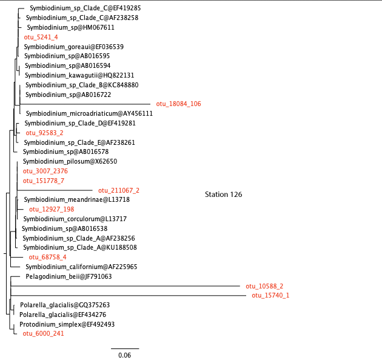

# Investigating taxa of interest
***

Metabarcoding data can also be used to investigate the biodiversity and ecology of taxa of interest. 

## *Symbiodinium*

In this part of the lab, we will focus on one particular genus, *Symbiodinium*, and investigate its distribution across the six stations (coral and open ocean). *Symbiodinium* is a genus of photosynthetic dinoflagellates. These micro-algae, colloquially called "zooxanthellae" are most well-known for being symbionts and the primary producers in reef-building corals. They are thus ecologically and economically important. There has been much research carried out on Symbiodinium biology and ecology in recent years in order to understand global coral reef decline.    


**Questions:**  
**22. Do you expect to find *Symbiodinium* in one or both environment types? Explain your reasoning.**  

Consider the following OTUs from station 49 (coral reef) which have been classified as *Symbiodinium*.

```{bash}
# station 49
cat data/vsearch_49.tsv | grep 'Symbiodinium' | tr '|' '\t' | cut -f 1,2,10,11
```

Column 1 represents the OTU, Column 2 represents % similarity to closest reference, Columns 3 and 4 represent genus and species respectively.

**Questions:**  
**23. How confident can you be that otu_3007;366 is a *Symbiodinium*? Why?**  
**24. How confident can you be that otu_13108;6 is a *Symbiodinium*? Why?**  

To resolve this, we will use the Evolutionary Placement Algorithm to "place" sequences in a reference tree. This is a very useful technique for classifying millions of short environmental reads or OTUs. Figure 7 shows an overview of the process.

<br>


<br>


1. For this, we need to first generate an 18S phylogeny from reference sequences from PR2. This has already been done for us. The tree below shows *Symbiodinium* sequences rooted with other dinoflagellates.  


<br>

2. We then “place” the OTUs from station 49 above on the reference tree using EPA. This algorithm decides the best location for each OTU without rebuilding the tree from scratch again. This has also been done for us, and the OTUs are shown in red colour.  


**Questions:**  
**25. How many OTUs are actually Symbiodinium? (These are OTUs that fall in the *Symbiodinium* clade.)**  
**26. Are the results consistent with your answers to questions 23 and 24?**  

Similar analyses have been carried out for you for the other stations. View the trees here below.  





**Questions:**  
**26. Are the results consistent with your answer to question 22?**  

<br>

Thus far, we have looked at presence/absence of *Symbiodinium* in coral reef waters and open ocean waters. We can also investigate if there is any difference in abundance (i.e. number of *Symbiodinium* reads from each of the stations). 


```{r}
# read data
sym_abundance <- read.csv("data/sym_abundance.txt", header = T, sep = "\t")

# order stations in the order we wangt to appear in the graph
sym_abundance$stations <- factor(sym_abundance$stations, c("station_45", "station_46", "station_50", "station_49", "station_121", "station_126"))

# custom theme
require(ggplot2)

cust_theme <- theme_dark() + 
  theme(axis.text.y = element_text(angle=90, hjust=0.5), axis.text.x = element_text(angle=90, vjust=0.5, hjust=1), strip.text.x = element_text(angle=180),
        panel.grid.major.x = element_blank(), panel.grid.minor.x = element_blank(), 
        strip.placement = "outside", 
        panel.background = element_rect(fill = "white"),
        strip.background =element_blank(), 
        panel.spacing = unit(0, "lines"),
        axis.ticks = element_blank())

# plot
ggplot(sym_abundance, aes(x = stations, y = rel_abundance)) + 
    geom_bar(aes(fill = env_type), color="white", stat = "identity", position = "dodge") +
    xlab("") + ylab("Symbiodinium abundance (% of reads)") +
    ggtitle("Symbiodinium abundance") +
    cust_theme
```


**Questions:**  
**27. Is there a trend in abundance of *Symbiodinium*?**  
**28. Based on these results, what can we say about the lifestyle of *Symbiodinium*? Does it exclusively live through symbiosis with corals?**  
**29. Does *Symdiodinium* have a free-living stage, or does it form symbioses with other organisms? We can test this hypothesis by looking at the presense and abundance of *Symbiodinium* in different size fractions on an online server. (Follow the instructions below and answer this question. Recall that *Symbiodinium* cells are usually between 6-13 microns in diameter.).**  


The [Ocean Barcode Atlas](https://oba.mio.osupytheas.fr/ocean-atlas/) is an online web service for rapidly analysing the biogeography of taxa using the entire Tara Oceans dataset. Go to the website and click on *Community ecological analysis*. In the *taxonomy* field, type in "Symbiodiniaceae", untick computation of beta diversity, set maps and bubble plots to 1, and submit your job. 

Select the following size fractions: 0.8-5 microns, 5-20 microns, 20-180 microns, 180-2000 microns. What does this tell us about the life cycle of *Symbiodinium*?


## Chytrids

Chytridiomycota (informally chytrids) are fungi with flagellated zoospores which have recently been uncovered as important parasites or saprotrophs of diatoms in marine systems (Figure 8).


**Question:**  
**30. Using the Ocean Barcode Atlas again, can you determine which temperature range do Chytridiomycota prefer? Are they more abundant in tropical waters?**  


  

