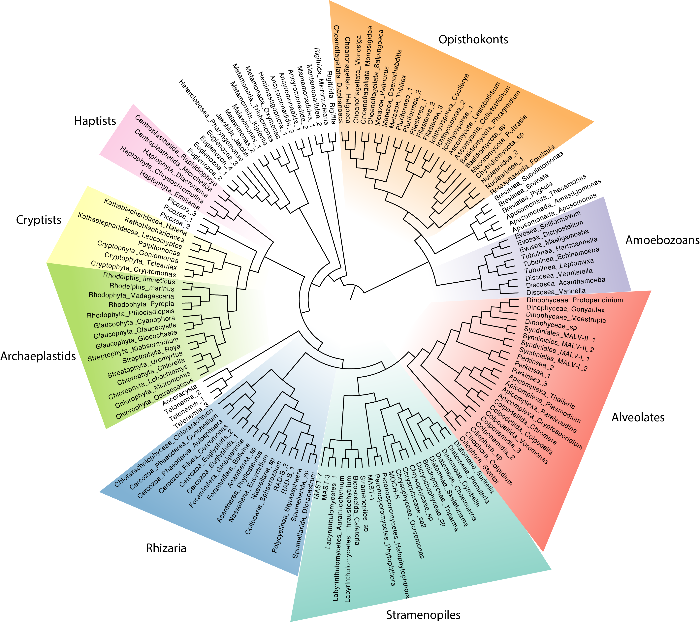

# Patterns of microbial community composition
***

## Oceans 

What factors explain the microbial community compositions in different environmental samples? We will now return to our six Tara Ocean stations (coral and non-coral), and quantify the differences in microbial communities between the stations, and cluster them based on their differences. The measure of dissimilarity we will use is Bray-Curtis, which is commonly used in ecology. You do not need to know how it works, however if you are interested in a short, easy to read summary, see [here](https://www.statology.org/bray-curtis-dissimilarity/)  

Importantly, the measure is between 0 and 1. Identical communities would have a Bray-Curtis dissimilarity of 0, while communities which share no species would have a Bray-Curtis dissimilarity of 1.

```{r}
# load required package
library(vegan)

# read data
matrix <- read.csv("data/chosen_stations_filtered_otus.tsv", header=T, sep = "\t", row.names = 1)

# view the data we are working with. The table contains read counts for each OTU in every station. Each row = OTU, each column = station.
head(matrix)

# transpose data so that rows and columns are switched
matrix_t <- t(matrix)

# normalise data
matrix_t_norm <- decostand(matrix_t, method = "total") 

# calculate Bray-Curtis distance and cluster the stations
matrix.bc.dist <- vegdist(matrix_t_norm, method = "bray")
matrix.bc.clust <- hclust(matrix.bc.dist, method = "average")
plot(matrix.bc.clust, ylab = "Bray-Curtis dissimilarity")
```


**Questions:**   
**31. What explains the clustering that we see?**  


## Comparing oceans, lakes, and soils

Finally, we are going to zoom out and compare the broad microbial communities from ocean, lake, and soil samples. To get an overview of the communities, we will phylogenetically place the metabarcoding sequences onto a reference phylogeny as we did for *Symbiodinium* previously. This time however, we will place OTUs on a global eukaryotic phylogeny with 155 annotated, reference 18S sequences (these sequences are derived from the PR2 18S database) (Figure 8). Note that because this tree is based on 18S sequences only, it is not entirely consistent with what we know from phylogenomics. However, this does not impact phylogenetic placement.




<br>

The three datasets we will be comparing today are the Malaspina dataset (a global marine expedition like the Tara Oceans), a freshwater dataset from Lake Baikal, and a dataset from Neotropical forest soils. We're opting for the Malapspina dataset instead of the Tara because like the soil and freshwater data, it covers the longer, V4 region instead of the V9 region. 

Let's have a cursory look at how many OTUs are in each dataset (NB: normally, we would normalize data first before comparisons, but for the purpose of this lab, it is okay to proceed with un-normalised data.)


**Marine - Malaspina**
```{bash}
# marine
cat data/malaspina.fasta | grep -c '>'
```

**Neotropical forest soils**
```{bash}
# soils
cat data/neotropical-soils.fasta | grep -c '>'
```

**Freshwater - lake Baikal**
```{bash}
# freshwater
cat data/baikal.fasta | grep -c '>'
```


The phylogenetic placement has already been carried out. Download the placement files from [GitHub](https://github.com/UU-Microbial-Eukaryotes/Metabarcoding_lab/). To do so, first download the GitHub repository as a zip file: i.e. *Code* (in top-right corner in green) --> *Download ZIP*. After saving, unzip the folder and navigate to *Metabarcoding_lab-master* --> *placement_files*. You will see three files with the extension *.jplace*.

Now for the fun part! We will use the interactive [Tree of Life website](https://itol.embl.de/upload.cgi) to visualize the difference between these three environments. Simply load each *.jplace* file (using the button "Choose file", selecting the file, and click "Upload"). I recommend using three tabs so you can view all files at the same time. 

You will now see a phylogenetic tree and a control panel. Select the following options in the control panel:

- *Mode options* --> *Branch lengths* --> *Ignore* (this will make it easier to view the placements)  
- *Label options* --> *Font style* --> *26 px* (or higher so you can view the tip labels)  
- *Datasets*  --> *Phylogenetic placements*  --> *On*  

You will now see bubbles on the tree branches. Each bubble represents OTU placements on a particular branch. The bigger the bubble, the more OTUs belong to that particular lineage!  


**Questions:**   
**32. What are the most dominant lineages in soils and freshwater samples?**  
**33. In which environment are fungi the most dominant?**   
**34. Which lineages are dominant in the oceans, but absent in freshwater and soils?**  
**35. Are there lineages present in freshwater/soils but absent in oceans? Which ones?** 
**36. List any other observations you find interesting!**  


## Fin

Discuss your answers with your TA :) 


