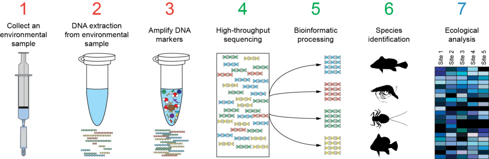

--- 
title: "Environmental diversity of microbial eukaryotes"
author: "Lab designed by Mahwash Jamy"
date: "`r Sys.Date()`"
site: bookdown::bookdown_site
documentclass: book
bibliography: [book.bib, packages.bib]
url: https://uu-microbial-eukaryotes.github.io/Metabarcoding_lab/
output:
  bookdown::html_document2:
    includes:
      in_header: header.html
  bookdown::gitbook:
    includes:
      in_header: header.html
description: |
  This is the metabarcoding lab for the Uppsala University course: Diversity and Evolution of Microbial Eukaryotes.
link-citations: yes
github-repo: UU-Microbial-Eukaryotes/Metabarcoding_lab
---


```{r setup, include=FALSE}
# Add a common class name for every chunks
knitr::opts_chunk$set(
  echo = TRUE)
```
```{r htmlTemp3, echo=FALSE, eval=TRUE}
codejs <- readr::read_lines("js/codefolding.js")
collapsejs <- readr::read_lines("js/collapse.js")
transitionjs <- readr::read_lines("js/transition.js")

htmlhead <- 
  paste('
<script>',
paste(transitionjs, collapse = "\n"),
'</script>
<script>',
paste(collapsejs, collapse = "\n"),
'</script>
<script>',
paste(codejs, collapse = "\n"),
'</script>
<style type="text/css">
.code-folding-btn { margin-bottom: 4px; }
.row { display: flex; }
.collapse { display: none; }
.in { display:block }
</style>
<script>
$(document).ready(function () {
  window.initializeCodeFolding("show" === "show");
});
</script>
', sep = "\n")

readr::write_lines(htmlhead, path = "header.html")
```


# Before you start the lab

This lab will introduce you to metabarcoding. Investigating this "hidden diversity” often relies heavily on bioinformatics. Here, most of the analyses have already been carried out for you, and the focus is on interpreting the results of the analyses. All graphs in this practical have been generated in R. The code is visible for those interested (don't worry if it does not make sense! The goal here is to interpret results) - but you can hide the code by clicking the `Hide` button above each code chunk. There are also a few dropdown boxes in the document that contain extra information, an example is shown below:

<details>
<summary>Dropdown box. Click me to get more information</summary>
<br>
More information
</details>

<br>


To complete this lab, answer all questions (in bold) and discuss them with your teaching assistant at the end of the lab.

Good luck! :)


## Learning outcomes

After completing this lab, you will be able to:  

- Explain how DNA can be used to study microbial diversity in a high-throughput way and contrast it with using morphology  
- Use given sequences to BLAST against a reference database and identify the corresponding organism  
- Explain the concept of metabarcoding, and assess its power and limitations  
- Classify sequences based on phylogenetic placement  
- Analyse the ecology of taxa of interest using sequence information  
- Analyse and assess how different microbial communities are structured  


## Motivation  

Microbes run the world! Protists and fungi play crucial ecological roles such as primary production, consumers and decomposers. But how do we study them given that they are so small? Furthermore, most of them are difficult to culture. One method is: using a metabarcoding approach!

<br>

  


<br>

Figure 1 shows an overview of the metabarcoding approach. The most commonly used DNA barcode for microbial eukaryotes is the **18S rDNA** gene (though it should be noted that the internal transcribed spacer, ITS, is more commonly used for fungi). In this lab, we will focus on the 18S gene using subsets of published sequencing data from: global marinesampling expeditions such as [Tara Oceans](https://www.science.org/doi/10.1126/science.1261605) and the [Malaspina Expedition](https://www.nature.com/articles/s41396-019-0506-9), [freshwater from Lake Baikal](https://www.mdpi.com/2076-2607/8/4/543), and [soils from Neotropical forests](https://www.nature.com/articles/s41559-017-0091).  
